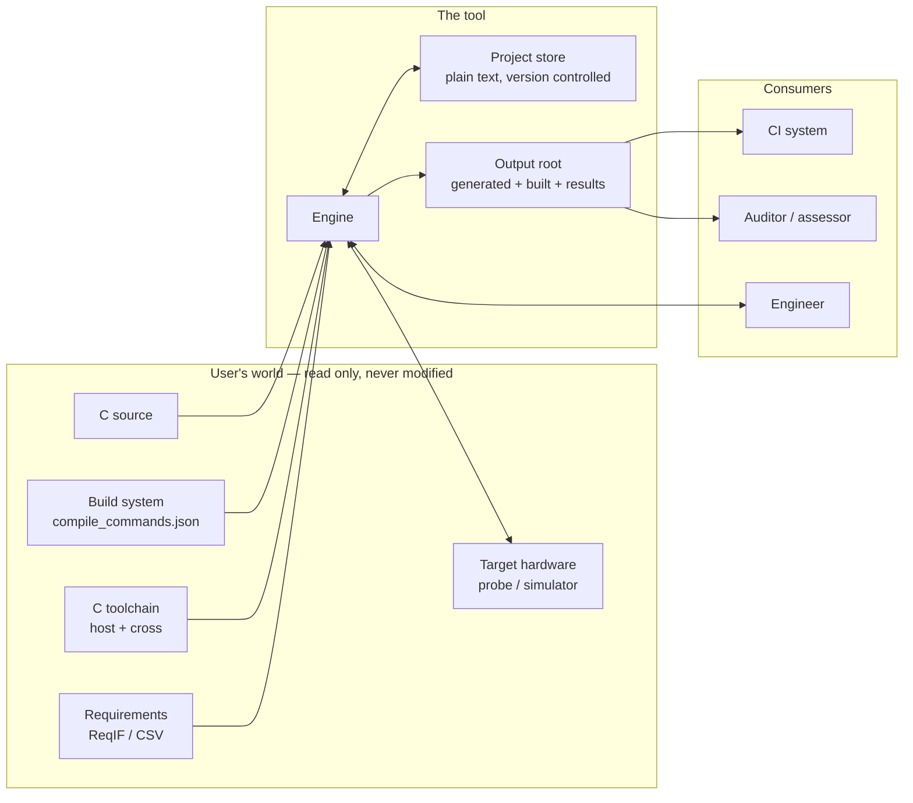
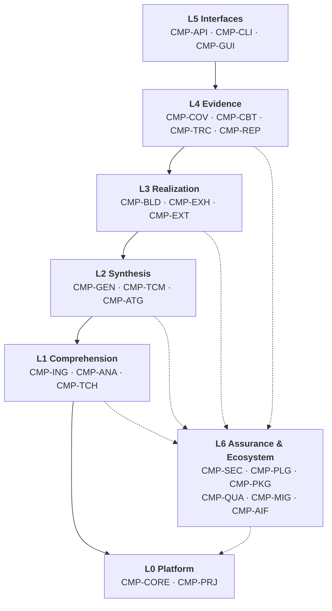
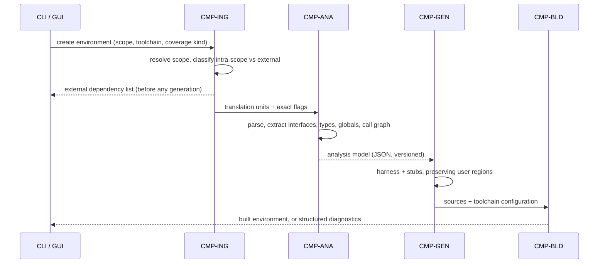
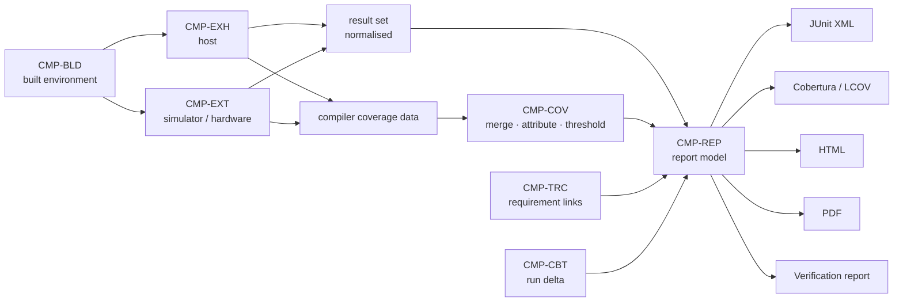

# SDD-001 — Architecture and Component Design

**Document ID:** SDD-001
**Version:** 0.1 (draft for review)
**Status:** Draft — tracks SRS-001 v0.1, which is not yet baselined
**Upstream:** SRS-001 v0.1, ADR-001 (analysis, no decision recorded)
**Machine-readable counterpart:** `design/trace/design-elements.yaml`

---

<!-- nav:start -->
**Related documents** — [SRS-001](../SRS-001-requirements.md) · [ADR-001](../ADR-001-architecture-decisions.md) · [ADR-006](../ADR-006-fork-or-build-fresh.md) · [ADR-008](../ADR-008-ai-structured-decision-provider.md) · **SDD-001** *(you are here)* · [SDD-002](SDD-002-interfaces.md) · [SDD-003](SDD-003-data-model.md) · [SDD-004](SDD-004-traceability-architecture.md) · [SDD-005](SDD-005-external-integration.md) · [Register](trace/design-elements.yaml) · [Design index](README.md)

Architecture diagrams: [specifications](diagrams) · published at [the documentation site](https://suduli.github.io/embedded-c-unit-test-tool/), which spells out every component id in full and shows how these documents connect.
<!-- nav:end -->

## 1. Purpose

This document describes the architecture of the tool specified by SRS-001 and
identifies, for every requirement in that specification, the design element
that discharges it.

It is one half of a pair. The other half — `design/trace/design-elements.yaml`
— carries the same allocation in machine-readable form and is validated on
every change by `design/trace/trace_check.py`. **Where the two disagree, the
register is authoritative and this document is defective.** That inversion is
deliberate: a traceability claim that only a human maintains stops being true
within a few revisions.

### 1.1 What this document is not

It does not choose an implementation language, a GUI toolkit, a symbolic
execution engine, a project file syntax, or a license. Those are ADR-001
through ADR-007 and none of them is decided. The architecture here is expressed
so that it *constrains* those decisions rather than presuming them, and every
element whose shape depends on an open decision names it (§8).

---

## 2. Architectural drivers

Five drivers in SRS-001 determine the shape of the system more than anything
else in it. Each is called out here because most of the structural choices
below are consequences of one of them.

| Driver | Requirement | Structural consequence |
|---|---|---|
| The analysis model is the only interface into generation | TOOL-PAR-100 | Exactly one component may hold a C front-end dependency (§4.2). This is what makes the ADR-001 language decision reversible. |
| Every capability must exist on the command line | TOOL-UIX-010, TOOL-CIC-010 | Front-ends are clients, not applications. Capability lives below the API boundary; presentation lives above it (§4.4). |
| All state is plain text under version control | TOOL-PRJ-010, TOOL-UIX-320 | No application database. The project store is the system of record and both front-ends read the same files (§4.1). |
| Outputs are deterministic and reproducible | TOOL-NFR-060, TOOL-REP-100 | Determinism is a platform property enforced centrally, not a convention each author is asked to follow (DSN-CORE-010). |
| Coverage comes from the compiler, never from the tool | A-04, TOOL-COV-010..080 | The coverage engine is an adapter over gcov/llvm-cov output. The toolchain's declared capability, not the tool's ambition, bounds what can be measured (DSN-TCH-040). |

Two further drivers come from ADR-001 rather than the SRS, and are treated here
as binding until an ADR supersedes them:

- **The seam must survive a language change** (ADR-001 §2.4). The JSON analysis
  model is held as an interface, not an implementation detail.
- **The nested type-aware test data editor is the schedule driver** (ADR-001
  R-02). It is the one UI component whose difficulty can invalidate the GUI
  technology choice, so it is isolated behind the same test case model the CLI
  uses (DSN-GUI-080) and prototyped before the architecture is frozen.

---

## 3. Context

Two boundaries in that picture are load-bearing:

- **Everything to the left is read-only.** TOOL-NFR-070 forbids modifying user
  source; DSN-CORE-060 makes it a structural property by opening user paths
  through a guard that raises on write, so a violation is a caught programming
  error rather than something review must notice.
- **The project store, not the tool, is the system of record.** A project
  survives the tool version that made it (TOOL-PRJ-030, TOOL-INS-050), which is
  the requirement that makes decade-scale evidence retention possible at all.

---

## 4. Layering

Seven layers. The rule is one line: **a component may depend on its own layer,
a lower one, or a component explicitly marked cross-cutting.** Only two are so
marked — `CMP-PLG` and `CMP-SEC` — and being in L6 confers nothing by itself:
`CMP-PKG`, `CMP-QUA`, `CMP-MIG` and `CMP-AIF` are ordinary application code
that happens to be cross-cutting in *subject*, not in dependency direction.
`trace_check.py` enforces this and detects cycles, so the rule cannot decay
silently.

The dotted edges are the ones that actually exist in the register: `CMP-TCH`,
`CMP-GEN`, `CMP-EXT` and `CMP-REP` depend on `CMP-PLG`, and `CMP-EXH` and
`CMP-EXT` on `CMP-SEC`. No L5 component depends on L6 at all — the front-ends
reach everything through the engine API.

The diagram above states the *rule* — which dependencies the layering permits.
For the graph as it actually stands, see the diagrams in [`diagrams/`](diagrams/),
rendered to interactive HTML under [`../docs/diagrams/`](../docs/diagrams/).
Those are authored rather than generated, but `trace_check.py --check-diagrams`
fails the build if they draw a component or an edge the register does not have,
or omit one it does, so they cannot drift from it either. The two are not
interchangeable: the permitted edges here are a superset of the real ones, and
the real graph skips levels freely.

| Layer | Name | Rule |
|---|---|---|
| L0 | Platform and Persistence | Depends on nothing above. Everything may depend on it. |
| L1 | Comprehension | Reads user code and build configuration; produces models; writes no generated code. |
| L2 | Synthesis | Consumes models only. **Never invokes a C front-end.** |
| L3 | Realization | Compiles and runs. Owns every subprocess that executes user-derived code. |
| L4 | Evidence | Consumes execution results. Produces what an auditor reads. |
| L5 | Interfaces | Front-ends. Hold no capability of their own. |
| L6 | Assurance and Ecosystem | Assurance concerns and extension surfaces. Only components marked `cross_cutting: true` may be depended on from below. |

### 4.1 L0 — Platform and Persistence

`CMP-CORE` holds the properties the SRS demands globally and that are
unenforceable if left to individual authors: determinism (DSN-CORE-010),
the structured error model and fail-safe termination (DSN-CORE-020),
cancellation with transactional state commits (DSN-CORE-040), output-root
confinement and source immutability (DSN-CORE-060), and the provenance record
every *generated* artifact embeds (DSN-CORE-100). The qualifier matters: project
files carry no timestamps or machine identity, which is what lets them stay
byte-stable under version control (SDD-003 §4).

`CMP-PRJ` is the on-disk project: schema-versioned plain text, sharded so that
the unit of a file is the unit of concurrent edit (DSN-PRJ-030), referenced by
relative path so a clone stays valid (DSN-PRJ-040), migrated only with explicit
confirmation (DSN-PRJ-020).

### 4.2 L1 — Comprehension

`CMP-ING` turns build reality into a project model, then into named **test
scopes**. The scope is the pivot of the whole design: it decides which
functions are linked real and which get stubbed (DSN-ING-090), and that single
classification is consumed by the harness generator, the coverage attributor,
and the coupling analysis. Unit and integration testing are therefore the same
mechanism with a different scope size, not two features.

`CMP-ANA` is **the only component permitted a C front-end dependency**. It emits
a versioned JSON analysis model (DSN-ANA-070) that is the sole input to every
downstream stage. Nothing else links, imports, or invokes libclang. This is the
seam ADR-001 §2.4 requires: a future C++ LibTooling analyzer emitting the same
model replaces `CMP-ANA` and nothing else moves. The CFG is behind a capability
flag (DSN-ANA-040) precisely because libclang cannot supply one, so consumers
degrade rather than break.

`CMP-TCH` makes a compiler a data file. The declared-capability mechanism
(DSN-TCH-040) is how the tool honours K-03 — refusing a metric the toolchain
cannot produce, rather than reporting an empty one.

### 4.3 L2–L4 — Synthesis, Realization, Evidence

`CMP-GEN` generates harness and stubs from the model through templates, and
owns the **regeneration contract** (DSN-GEN-070): generated regions are
rewritten, delimited user regions are carried forward, and a change that makes
a user region untenable is reported as a conflict rather than resolved
silently. That contract is what makes generation safe to re-run, which is what
makes it usable at all.

`CMP-ATG` is a synthesis component that needs to build, run, and measure —
capabilities that live above it. It does not depend upward; it declares a
`TestValidationPort` bound at composition time (DSN-ATG-110). The layer graph
stays acyclic and generation stays testable against a stub port.

`CMP-COV` is an adapter over compiler output, not an instrumenter. Two of its
elements exist to prevent specific misrepresentations: DSN-COV-040 detects
expressions the compiler declined to instrument, because they otherwise read as
fully covered; DSN-COV-080 binds a coverage-by-analysis justification to the
digest of the source it justifies, so editing that source expires the
justification instead of silently carrying it forward.

`CMP-REP` renders from **one** persisted intermediate report model
(DSN-REP-010). Every format — JUnit, Cobertura/LCOV, HTML, PDF, the
verification report — is a renderer over it. Adding a format needs no tool
change and no re-execution (TOOL-PLG-050, TOOL-REP-150), and no two renderings
of a run can disagree.

### 4.4 L5 — Interfaces

`CMP-API` is the single boundary every front-end crosses: a versioned JSON
protocol over stdio or a filesystem-permissioned local socket. **No TCP
listener is offered** (DSN-API-030) — an open localhost port is a
security-policy problem in exactly the defence, aerospace, and automotive
environments this tool targets (ADR-001 §3.3).

The CLI is generated from the same operation catalogue the API publishes
(DSN-CLI-010), so a new capability cannot become GUI-only by omission. Every
API response carries the equivalent CLI invocation (DSN-API-040), which is what
makes the console pane of TOOL-UIX-240 and the round-trip guarantee of
TOOL-UIX-330 fall out of the design rather than needing separate work.

### 4.5 L6 — Assurance and Ecosystem

`CMP-AIF` is structurally quarantined rather than merely configurable: it is
the only component carrying an outbound network capability (DSN-CORE-090), it
is separable, and with it absent everything else is unaffected. Its provenance
record — model identity, prompt, temperature, seed, review state — is immutable
and travels into every report (DSN-AIF-110). It reaches a model only through
the AI-provider extension point in `CMP-PLG` (DSN-PLG-050), bound per role —
free-text generation and structured decision — so each role's back end,
including a local or self-hosted model, is replaceable without touching the
feature that calls it (DSN-AIF-020, DSN-AIF-160; ADR-008).

`CMP-PLG` publishes the four tool extension points plus the AI-provider point,
and DSN-PLG-040 requires the
tool's own compiler configurations, framework back-ends, and report formats to
be implemented through them, with no private interface. That is the only
mechanism that reliably keeps an extension interface sufficient.

---

## 5. Component register

24 components, 243 design elements. Requirement counts are per component.
Five requirements are legitimately discharged by more than one element — `TOOL-COV-060`, `TOOL-EXE-010`, `TOOL-MIG-060`, `TOOL-PRJ-050`, `TOOL-UIX-320` —
and four of those span two components, so the column sums to 331 rather than 327.

| Layer | Component | Name | Elements | Reqs |
|---|---|---|---:|---:|
| L0 | `CMP-CORE` | Core Platform Services | 14 | 23 |
| L0 | `CMP-PRJ` | Project and Workspace Store | 8 | 12 |
| L1 | `CMP-ING` | Ingestion and Scope Resolver | 11 | 19 |
| L1 | `CMP-ANA` | Source Analyzer | 9 | 13 |
| L1 | `CMP-TCH` | Toolchain Abstraction | 8 | 12 |
| L2 | `CMP-GEN` | Generation Engine | 16 | 29 |
| L2 | `CMP-TCM` | Test Case Model and Store | 11 | 15 |
| L2 | `CMP-ATG` | Automatic Test Generation | 11 | 11 |
| L3 | `CMP-BLD` | Build Orchestrator | 5 | 4 |
| L3 | `CMP-EXH` | Host Execution Runner | 6 | 7 |
| L3 | `CMP-EXT` | Target Execution Runner | 10 | 12 |
| L4 | `CMP-COV` | Coverage Engine | 10 | 17 |
| L4 | `CMP-CBT` | Change Impact and Regression | 5 | 7 |
| L4 | `CMP-TRC` | Traceability Engine | 8 | 10 |
| L4 | `CMP-REP` | Reporting Pipeline | 13 | 18 |
| L5 | `CMP-API` | Engine Service Interface | 4 | 5 |
| L5 | `CMP-CLI` | Command Line Front-End | 6 | 7 |
| L5 | `CMP-GUI` | Standalone Desktop Application | 27 | 33 |
| L6 | `CMP-SEC` | Security and Integrity Services | 11 | 13 |
| L6 | `CMP-PLG` | Extension Framework | 5 | 5 |
| L6 | `CMP-PKG` | Packaging, Installation and Release Engineering | 13 | 17 |
| L6 | `CMP-QUA` | Qualification Evidence | 8 | 8 |
| L6 | `CMP-MIG` | Migration and Interoperability | 8 | 8 |
| L6 | `CMP-AIF` | AI Assist Subsystem | 16 | 26 |

Full element statements, with their requirement allocations, are in
`design/trace/design-elements.yaml`. The per-requirement view is
`design/trace/requirement-matrix.csv`.

---

## 6. Principal flows

### 6.1 Environment creation

The external dependency list is returned **before** generation
(TOOL-ING-180, DSN-ING-090) so the stubbing consequence of a scope choice is
visible while the choice is still cheap to change.

### 6.2 Execution and evidence

Host and target converge on one normalised result set (DSN-EXH-010,
DSN-EXT-060), which is why a test case runs unmodified on both. Everything an
auditor sees is a rendering of one persisted model, which is why the renderings
cannot disagree and why a report can be regenerated years later with no
re-execution.

---

## 7. Cross-cutting design rules

These are properties no single component can guarantee. Each is centralised
somewhere and enforced from there.

| Rule | Where enforced | Requirements |
|---|---|---|
| Determinism | `DSN-CORE-010` — sorted iteration, content-derived identifiers *for generated artifacts*, injected clock; `DSN-PRJ-030` and `DSN-REP-080` apply it to project files and reports | TOOL-NFR-060, TOOL-PRJ-050, TOOL-REP-100 |
| Source immutability | `DSN-CORE-060` — read-only path guard, output-root confinement | TOOL-NFR-070, TOOL-NFR-080, TOOL-PRJ-080 |
| Offline operation | `DSN-CORE-090` — the core carries no network client at all; `DSN-API-030` offers no TCP transport | TOOL-NFR-100, TOOL-UIX-050 |
| Provenance | `DSN-CORE-100` — one record embedded by every generated artifact and reportable on request; `DSN-REP-060` renders it | TOOL-QUA-060, TOOL-INS-110, TOOL-REP-070 |
| Schema versioning | `DSN-PRJ-010`, `DSN-ANA-070`, `DSN-API-020`, `DSN-REP-110` | TOOL-PRJ-020, TOOL-PAR-110, TOOL-PLG-060, TOOL-REP-130 |
| Configuration is data | `DSN-SEC-060` — no format supports expressions, includes, or hooks | TOOL-SEC-070 |
| Nothing overclaimed | `DSN-COV-040`, `DSN-COV-080`, `DSN-CBT-030`, `DSN-ATG-080`, `DSN-AIF-110`, `DSN-QUA-070` | TOOL-COV-080, TOOL-CBT-040, TOOL-ATG-080, TOOL-AIF-090, TOOL-QUA-090 |

The last row is the one worth reading twice. Six independent elements exist for
a single purpose: making the difference between *verified*, *unverified*, and
*asserted-but-unreviewed* impossible to lose. Unmeasured decisions, expired
justifications, partial runs, unreviewed generated expectations, and
AI-produced artifacts each carry a flag in the data model, and every renderer
is obliged to show it. In a tool whose output is evidence, silently optimistic
reporting is the most damaging defect class available, and it is not
preventable by review alone.

---

## 8. Decisions this design leaves open

All but one of the decisions below can go either way without rework; ADR-006 is
the exception and is called out as such. Elements whose *shape* waits on a
decision carry an `open:` field naming it, and are machine-queryable through it.
The "elements affected" column is broader than that set — it also names elements
that merely *bear* the consequence of a decision without being blocked by it
(`DSN-ANA-070` is the seam that absorbs the language choice, not a victim of
it), and those carry no marker.

| Open decision | Elements affected | How the design absorbs the outcome |
|---|---|---|
| ADR-001 §2 — core language — **Accepted 2026-09-19: Python** | `DSN-ANA-040`, `DSN-ANA-070` | The analysis model is an interface. A C++ analyzer emitting the same JSON replaces `CMP-ANA` with no downstream change — kept as design record even though decided, since the seam is load-bearing either way. |
| ADR-001 §3 — GUI technology — **Accepted 2026-09-19: PySide6** | `DSN-GUI-010`, `DSN-GUI-080` | The GUI holds no capability. Its data contract is the test case model, not a GUI-private structure. A technology change is a rewrite of L5 only. |
| ADR-002 — project/test data format | `DSN-PRJ-010`, `DSN-TCM-020` | Surface syntax is confined to a serialisation adapter; the model layer is format-agnostic. |
| ADR-003 — symbolic execution engine | `DSN-ATG-020`, `DSN-ATG-030` | Both engines implement one adapter interface, and the component is optional and never on a default install path. |
| ADR-004 — coverage backend strategy | `DSN-COV-010` | Per-toolchain adapters. Designating one primary reduces adapter count; it does not change the interface. |
| ADR-005 — license | `DSN-PKG-090` | Structural rule (copyleft at process boundaries) is independent of which permissive license is chosen. |
| ADR-006 — fork UTBotCpp — **Accepted 2026-09-19: build fresh, do not fork** | Components, not elements: `CMP-ANA`, `CMP-ATG`, `CMP-GEN` | Was **not absorbable** by design — a fork would have reset the language decision and the framework back-end together, which is exactly why this one could not be left open past this point. See [`ADR-006-fork-or-build-fresh.md`](../ADR-006-fork-or-build-fresh.md). |
| ADR-007 — packaging | `DSN-PKG-010` | Confined to `CMP-PKG`; no other component observes the packaging mechanism. |
| ADR-008 — AI structured-decision provider — **Accepted: TypeSafe AI (Jev) as opt-in default** | `DSN-AIF-150` | The default is a configuration entry behind DSN-PLG-050, not a code dependency. Changing it — ADR-008 §6 names when it reopens — edits one profile and nothing else. |
| SRS open question 2 — MC/DC form | `DSN-COV-020` | The form obtained is a data field on the coverage model, rendered by every report — not a documentation claim. |
| SRS open question 9 — debugger | `DSN-EXH-060`, `DSN-GUI-140` | The engine prepares and reports the invocation; the front-end choice is confined to L5. |

**ADR-006 was the one genuine blocker, and it is now cleared.** The remaining
rows above (ADR-002 through ADR-005, ADR-007, and the two SRS open questions)
can still be decided late without rework — that is what distinguished ADR-006
from every other row in this table, not a claim that this table is now empty.

---

## 9. Known design risks

Carried forward from ADR-001 §6, with the design element that mitigates each.

| Risk | Mitigating element | Residual concern |
|---|---|---|
| R-01 libclang AST proves insufficient | `DSN-ANA-040` capability flag, `DSN-ANA-070` seam | Schedule, not architecture — provided the seam is held absolutely. |
| R-02 nested test data editor harder than estimated | `DSN-GUI-080` | Real. Prototype before architecture freeze; it is the schedule driver. |
| R-04 MC/DC form inadequate for an assessor | `DSN-COV-020` | Design cannot mitigate this; it can only make the form impossible to misread. |
| R-05 unbounded compiler/target support burden | `DSN-TCH-010`, `DSN-PLG-040` | Depends on extension points being genuinely sufficient, which DSN-PLG-040 tests by construction. |
| R-09 symbolic execution engine destabilises builds | `DSN-ATG-020` | Contained by keeping the component optional and off the default install path. |

---

## 10. Related documents

| Document | Content |
|---|---|
| `SDD-002-interfaces.md` | The contracts at each seam: analysis model, engine API, extension points, ports |
| `SDD-003-data-model.md` | Persisted artifacts, schema versioning, on-disk layout |
| `SDD-004-traceability-architecture.md` | The trace meta-model, ID rules, tooling, and CI gate |
| `design/trace/design-elements.yaml` | Authoritative requirement allocation |
| `design/trace/requirement-matrix.csv` | Generated per-requirement view |
