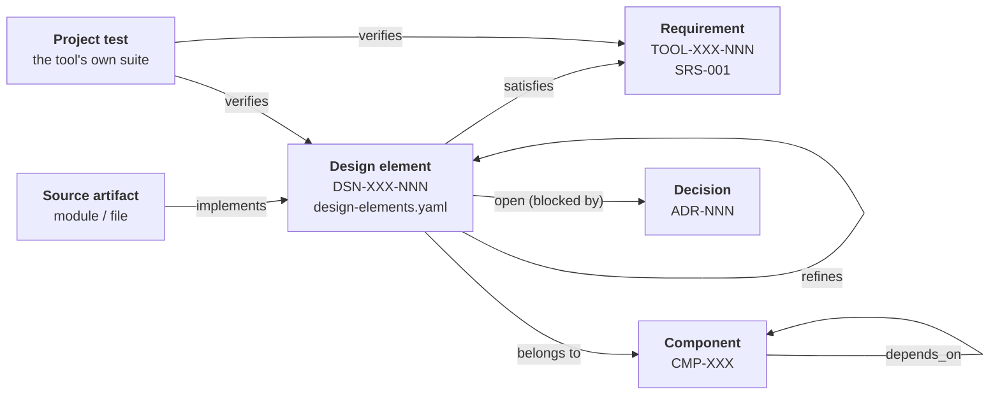

# SDD-004 — Traceability Architecture

**Document ID:** SDD-004
**Version:** 0.1 (draft for review)
**Status:** Draft — tracks SRS-001 v0.1
**Upstream:** SRS-001 §28, ADR-001 §1 (qualification scope)

---

## 1. Purpose and scope

This document defines how artifacts of **this project** trace to each other:
requirements to design, design to code, code to the project's own tests.

### 1.1 A distinction worth making once, clearly

There are two traceability systems in play and confusing them causes real
damage:

| | **This document** | **`CMP-TRC`** |
|---|---|---|
| Traces | The project's own SRS → design → code → tests | The *user's* requirements → the *user's* test cases |
| Serves | The project's developers and reviewers; ADR-001 Tier 1 qualification discipline | The tool's users, producing their own evidence |
| Specified by | SRS-001 §28 | TOOL-TRC-010 through TOOL-TRC-100 |
| Lives in | `design/trace/` | The tool's implementation |

They share a shape and will eventually share tooling — once `CMP-TRC` exists,
the project can dogfood it on itself, which is the most convincing validation
available (TOOL-QUA-030). Until then this system is deliberately small and
independent, because a traceability system that depends on the product it is
tracing cannot be used to build that product.

### 1.2 Why this exists in v1.0

ADR-001 §1.3 puts "unique release identification, reproducible builds, a known
error list, Tool Operational Requirements, and a user-executable validation
suite" in Tier 1 — do it in v1.0, because retrofitting is far more expensive.
Requirement-to-design traceability is the same case: it is cheap while there are
239 design elements and no code, and it is close to impossible to reconstruct
honestly after the fact.

---

## 2. Meta-model



| Item | Id format | Authority | Stable |
|---|---|---|---|
| Requirement | `TOOL-<CAT>-<NNN>` | `SRS-001-requirements.md` | Permanent; never reused or renumbered (SRS §2.1) |
| Design element | `DSN-<CODE>-<NNN>` | `design/trace/design-elements.yaml` | Permanent, same rule |
| Component | `CMP-<CODE>` | same file | Permanent |
| Decision | `ADR-<NNN>` | `ADR-*.md` | Permanent; superseded, never deleted |
| Source artifact | file path | the repository | — |
| Project test | test id | the project's own suite | — |

`<CODE>` is shared between a component and its elements: `CMP-COV` owns
`DSN-COV-*` and nothing else. The checker enforces it, which means the id alone
tells a reader which component a design element lives in.

### 2.1 Link types

Extending the three link types SRS-001 §28 recommends:

| Link | From → To | Cardinality | Rule |
|---|---|---|---|
| `satisfies` | design element → requirement | many-to-many | Every in-scope requirement needs ≥ 1 inbound. Most elements have 1–3 outbound. |
| `refines` | design element → design element | many-to-one | Carries no allocation of its own; inherits the parent's. |
| `depends_on` | component → component | many-to-many | Acyclic; same layer or lower, plus L6. |
| `implements` | source artifact → design element | many-to-many | Declared in a source header comment (§5). |
| `verifies` | project test → requirement or element | many-to-many | Declared in the test (§6). |
| `open` | design element → decision | many-to-one | Marks an element whose shape depends on an undecided ADR. |

**Many-to-many is permitted and normal.** TOOL-PRJ-050 (project data stable
under version control) is genuinely discharged by two elements — the platform
determinism policy and the project serialiser — and forcing a single owner would
misrepresent the design. What is *not* permitted is zero.

### 2.2 Derived elements

An element may exist without satisfying any requirement, if it declares
`derived: true` and a `rationale`. Two exist today:

- `DSN-BLD-050` — structured build diagnostics. No requirement asks for them
  directly; TOOL-UIX-090 and TOOL-ING-070 both need them, and duplicating
  diagnostic parsing per front-end would be the alternative.
- `DSN-ATG-110` — the `TestValidationPort`. A structural consequence of
  TOOL-ATG-050 needing execution feedback inside a synthesis-layer component.

Derived elements are how a design records work the requirements imply but do not
state. Requiring an explicit `rationale` is what keeps the category from
becoming a place to put anything unallocated.

---

## 3. The register

`design/trace/design-elements.yaml` is the authoritative allocation. The SDD
documents are its human-readable rendering, and **where they disagree the
register wins and the SDD is defective**.

That inversion is the central design choice of this system. Prose traceability
decays: an element gets renamed, a requirement gets split, and the tables in a
document silently stop being true while continuing to look authoritative. A
machine-checked register cannot drift without failing.

Element entries carry:

```yaml
- id: DSN-COV-040
  title: Non-instrumentable expression detection
  statement: >
    Boolean expressions the compiler declined to instrument ... are detected by
    reconciling the analysis model's decision inventory against the coverage
    output, and reported as unmeasured.
  satisfies: [TOOL-COV-080]
  verification: T
  open: ADR-004          # optional — the decision this element's shape waits on
```

`statement` is required to describe *how* the requirement is discharged, not
restate it. "The tool shall detect non-instrumentable expressions" would be a
requirement restated and would add nothing; naming the reconciliation between
the analyzer's decision inventory and the compiler's output is a design.

`verification` carries the SRS method (T/A/D/I) forward, so the eventual
validation suite (TOOL-QUA-030) knows what kind of evidence each element needs.

---

## 4. Checking

```
$ python3 design/trace/trace_check.py
```

All findings are fatal. They fall into four groups:

**The gate proper — is every requirement covered?**

| # | Error |
|---|---|
| 1 | An in-scope requirement is allocated to no design element |
| 2 | A design element `satisfies` a requirement id that does not exist in SRS-001 |
| 3 | A design element allocates a Future-priority requirement (out of v1.0 scope) |

**Can the checker even see the requirements?** This group exists because the
worst outcome available to this script is not a false alarm but a false *pass*.

| # | Error |
|---|---|
| 4 | A line that looks like a requirement definition but does not match the strict form — an unparsed requirement would be a silently unchecked one |
| 5 | The number of requirements parsed differs from the count the register declares (`document.upstream[SRS-001].requirement_count`) |
| 6 | A duplicate requirement id in the SRS |

**Is the register well formed?**

| # | Error |
|---|---|
| 7 | A duplicate design element or component id, or an element id whose code does not match its component |
| 8 | An element with neither `satisfies` nor `derived: true`; a `derived` element with no `rationale` or one that also allocates |
| 9 | A field of the wrong shape — `satisfies: "X"` where a list is meant, a non-boolean `derived`, a non-string `open` |
| 10 | A requirement listed twice in one element's `satisfies` |
| 11 | An element whose declared `verification` does not cover the SRS methods of every requirement it allocates |

**Is the architecture intact?**

| # | Error |
|---|---|
| 12 | `refines` or `depends_on` pointing at something that does not exist |
| 13 | An element that `refines` itself, or a cycle in the refines graph |
| 14 | A dependency on a higher layer that is not marked `cross_cutting: true`, or a cycle in the component graph |

Errors 1 and 2 are the original gate. Error 2 catches SRS drift: a requirement
renumbered or deleted upstream surfaces immediately as a dangling reference
rather than as a design element quietly pointing at nothing.

Errors 4 and 5 exist because error 1 alone is not enough. A requirement whose
formatting drifts — an ASCII hyphen instead of an em dash, a stray bullet — was
previously skipped in silence, so *deleting* a requirement from the design and
mangling its SRS line in the same commit passed cleanly. Both are now caught
independently: the sentinel flags the malformed line, and the declared count
catches any wholesale loss that a future id scheme might slip past the sentinel.

Error 11 was added after it found 18 real cases in this register. An element
bundling requirements verified by test, analysis *and* inspection could declare
only one method, which would scope the eventual validation suite (§6) from the
wrong evidence type.

Current state:

```
Requirement allocation
  SRS requirements            323
  out of v1.0 scope (F)       2
  in scope                    321
  allocated                   321
  UNALLOCATED                 0
  design elements             239
  derived (no requirement)    2
  components                  24
```

(followed by per-priority, per-phase and per-category tables, each row marked
`ok` or `GAP`)

Every priority (M/S/C), every phase (P1–P4), and all 24 categories are fully
allocated. Two requirements are unallocated by design: `TOOL-UIX-390` and
`TOOL-UIX-400` carry priority F, and allocating either is an error, not an
achievement — an F requirement in the design means v1.0 scope has quietly grown.

### 4.1 Derived artifacts

```
$ python3 design/trace/trace_check.py \
    --emit-matrix design/trace/requirement-matrix.csv \
    --emit-json   design/trace/trace-graph.json
```

| Artifact | Form | Use |
|---|---|---|
| `requirement-matrix.csv` | One row per requirement: priority, phase, verification method, components, elements, status | Review, import into a requirements tool, spreadsheet filtering |
| `trace-graph.json` | The full graph, both directions | Programmatic queries, future report generation |

Both are **generated**. Regenerate rather than edit; a hand-edit is overwritten
on the next run and, worse, is not checked.

---

## 5. Extending to code

Not yet active — there is no code. Defined now so it is not invented
inconsistently later.

A source file declares its allocation in a header comment:

```c
/* implements: DSN-COV-040, DSN-COV-030 */
```

```python
# implements: DSN-ANA-070
```

Then `trace_check.py` gains two checks:

- **Dangling** — an `implements` naming an element that does not exist.
- **Unimplemented** — a design element for a phase that is claimed complete with
  no inbound `implements`. Scoped by phase, so P3 elements do not report as gaps
  during P1.

Deliberately kept to file granularity. Function-level trace comments are
higher-fidelity in principle and, in practice, are the first thing to rot under
refactoring; file-level survives ordinary code movement.

---

## 6. Extending to the tool's own tests

The tool's validation suite (TOOL-QUA-030, TOOL-NFR-140) declares what it
verifies:

```python
def test_expired_justification_reports_uncovered():
    """verifies: TOOL-COV-150, DSN-COV-080"""
```

This closes the loop from requirement to design to code to evidence, and it is
what makes the user-executable validation suite of TOOL-QUA-030 a genuine
demonstration of the Tool Operational Requirements rather than a test suite that
happens to ship. A `verifies` link permits a requirement id, a design element
id, or both — some requirements (`TOOL-NFR-060`, determinism) are verified
system-wide rather than per element.

Verification-method coverage becomes checkable at that point. An element's
`verification` field is a *set* of methods — already validated against the SRS
methods of everything it allocates (error 11) — so the obligation is per method:
a `T` needs an inbound `verifies` from a test, while `I` and `A` are discharged
by a review or analysis record. An element declaring `[A, I, T]` needs all
three, which is precisely why under-declaring it mattered.

---

## 7. Change control

Once SRS-001 is baselined:

| Upstream change | Consequence here |
|---|---|
| New requirement added | `trace_check.py` fails with an unallocated requirement. Allocate it, or record explicitly why it is out of scope. |
| Requirement materially changed | Per SRS §30 it gets a **new id**; the old one is marked superseded. The dangling reference surfaces as error 2. |
| Requirement deleted | Same — error 2 on the stale reference. |
| Requirement re-phased | No structural failure. Review whether the allocated element still belongs where it is; ADR-001 §1.6 already proposes re-phasing several QUA requirements. |
| ADR decided | The elements carrying `open: ADR-NNN` are reviewed against the decision and the marker removed. |

Design element ids follow the SRS rule: **never reused, never renumbered.** A
deleted element leaves its number unused. A materially changed element gets a
new id and the old one is marked superseded. This matters because `implements`
comments in source and `verifies` links in tests both point at these ids, and
renumbering silently repoints them at the wrong thing.

### 7.1 Review gate

Any change to `design-elements.yaml` requires `trace_check.py` to pass, and any
change to allocation requires the corresponding SDD prose to be updated in the
same commit. The check runs in CI:

```yaml
- name: Requirement traceability
  run: python3 design/trace/trace_check.py --check-diagrams design/diagrams
```

Exit codes: `0` clean, `1` findings, `2` could not run.

`--check-diagrams` extends the gate to the architecture diagrams in
`design/diagrams/`. Those are authored by hand rather than emitted, because
choosing what belongs on a page is an editorial judgement and a mechanical
rendering of a 69-edge graph is unreadable. Hand-authoring would normally make
them a second source of truth — the exact failure §3 argues against — so the
check constrains what they are permitted to assert:

| Failure | Meaning |
|---|---|
| draws a component not in the register | the diagram names something that does not exist |
| draws an edge that is not a `depends_on` | the diagram asserts a dependency the design does not have |
| omits an edge of a component it *owns* | the diagram under-reports a real dependency |
| a component owned by no diagram | some part of the design is drawn nowhere |
| a component owned by more than one diagram | two views are each partially answerable for it |

Ownership is declared per node by the `tag` field. A bare layer id (`L4`) means
the diagram is answerable for that component's outgoing edges; a tag ending in
`context` means the node is drawn only as a dependency target and its edges
belong to whichever view owns it. This is the same convention the diagrams state
in prose to their readers, made machine-checkable.

The rendered HTML under `docs/diagrams/` is **not** covered by the determinism
gate. It is produced by a third-party renderer whose output is not byte-stable
across versions, so requiring it to regenerate identically would make the build
depend on a pinned toolchain for no traceability benefit. The specifications are
what carry the facts, and they are what is checked.

---

## 8. Interoperating with StrictDoc or OpenFastTrace

SRS-001 §28 anticipates adopting one of these. This system is shaped to make
that a migration rather than a rewrite:

- Requirement ids are already stable, unique, and greppable.
- Link types (`satisfies`, `refines`, `implements`, `verifies`) are already the
  ones both tools use.
- The register is already machine-readable with a stable schema.
- `trace-graph.json` is a direct source for a generated import.

Recommendation: **do not adopt one yet.** The current tooling is under 700 lines
with one dependency, and while SRS-001 is unbaselined and the design is moving, the
cost of a format migration exceeds the benefit. Revisit when the SRS is
baselined or when `implements` links start accumulating — whichever comes first.
The one thing to preserve until then is id stability, because it is the only
part that cannot be reconstructed later.

---

## 9. What this system does not do

Stated plainly, because a traceability system that is believed to do more than
it does is worse than none:

- **It does not verify that the design is correct** — only that every
  requirement has a named home and that the graph is well formed. A wrong design
  element passes every check.
- **It does not verify that a `statement` describes what an implementation
  does.** That is review, and the `implements` link only says code *claims* to
  implement an element.
- **It does not constitute tool qualification evidence.** Per ADR-001 §1.2 and
  TOOL-QUA-090, the project targets *qualifiable*, not *qualified*. This is one
  input to a user's own qualification argument and is described as such.
- **It does not cover the two Future requirements**, by design.
