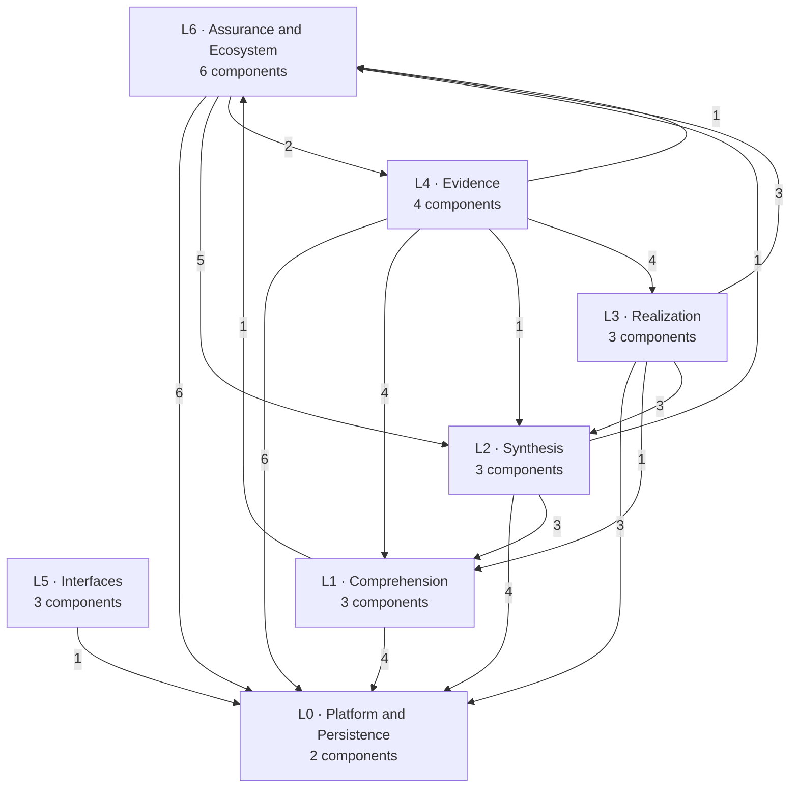
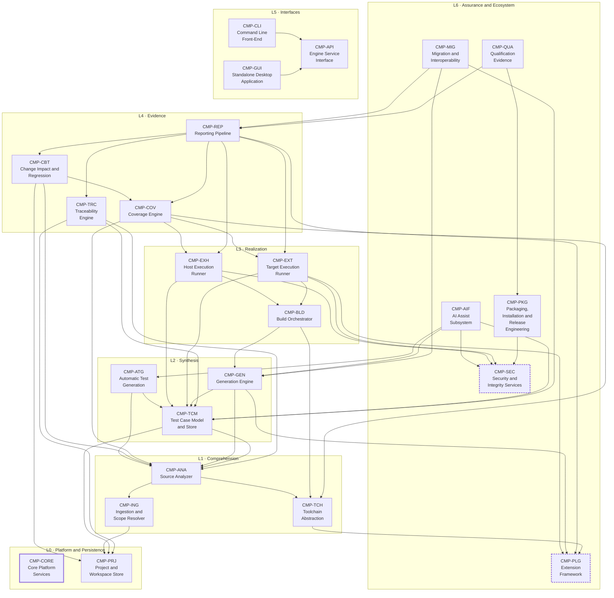
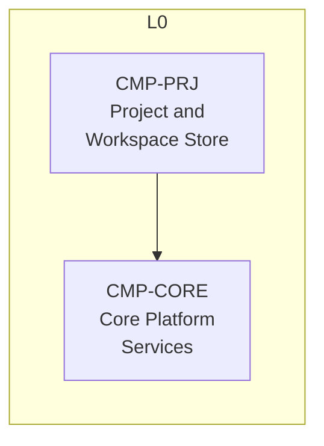
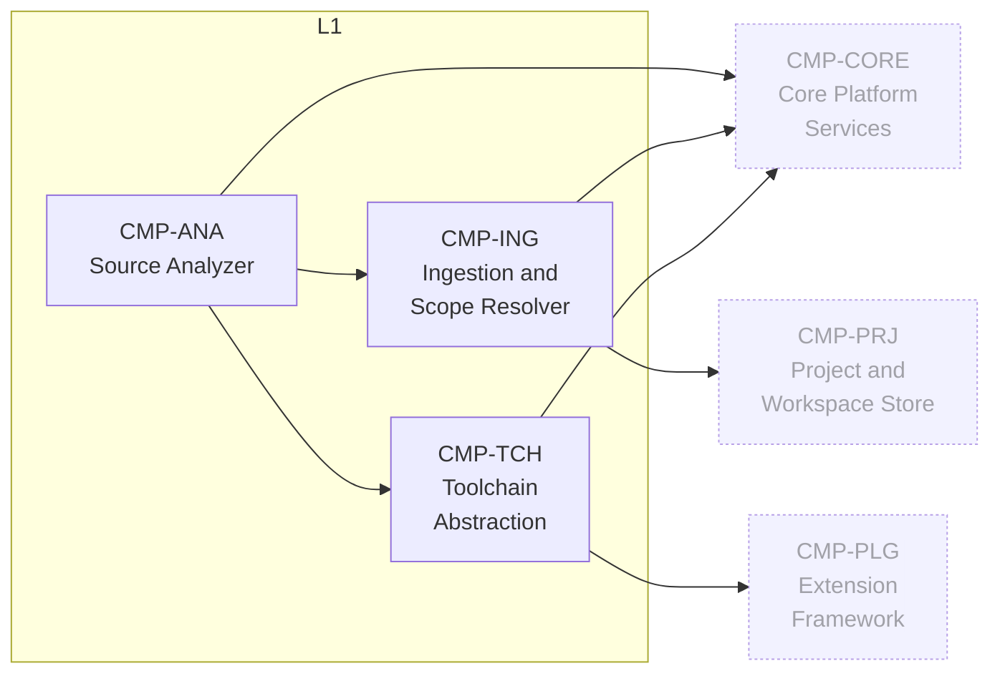
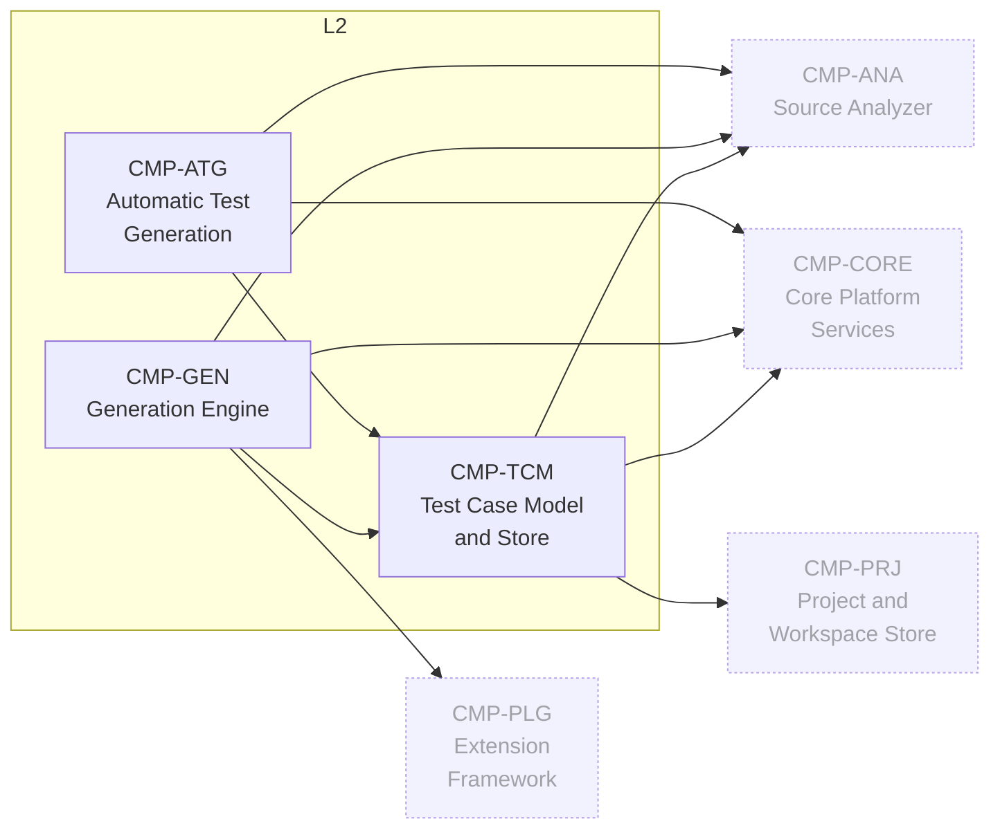
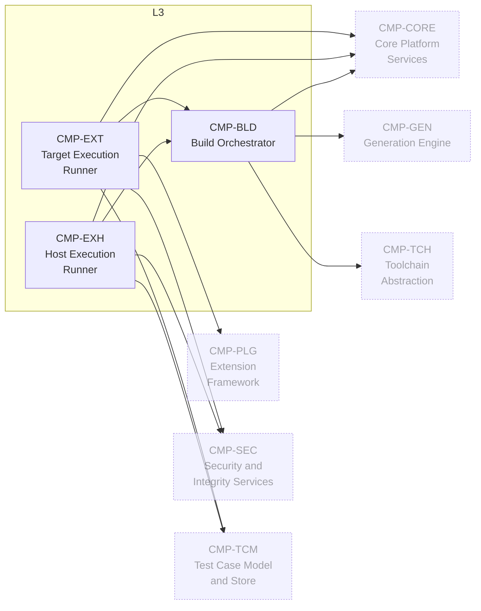
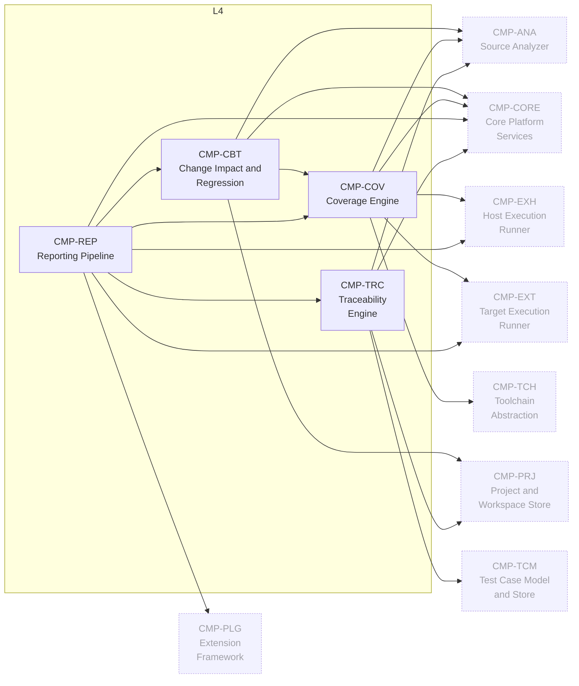
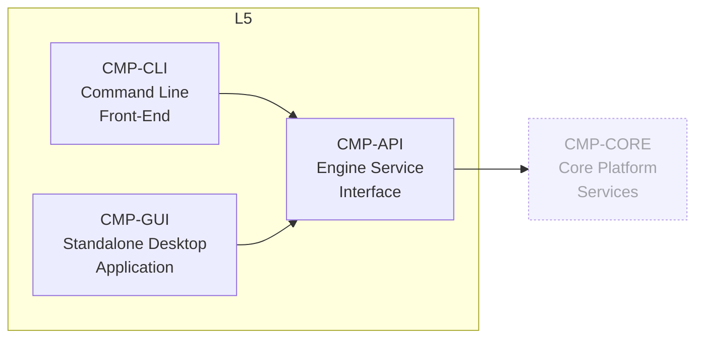
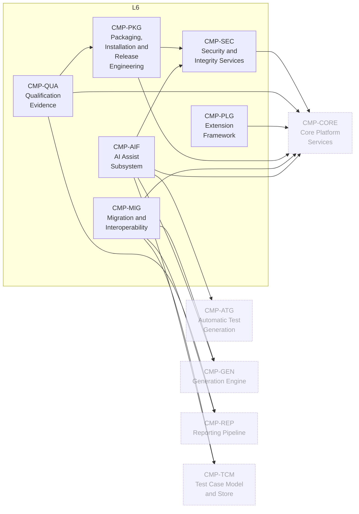

# Architecture diagrams

**Generated — do not edit.** Produced by [`trace/trace_check.py`](trace/trace_check.py) from [`trace/design-elements.yaml`](trace/design-elements.yaml), which is the authoritative register. Everything below is derived from the same component graph the checker validates, so it cannot drift from the design it depicts.

```sh
python3 design/trace/trace_check.py \
  --emit-mermaid design/architecture-diagrams.md
```

24 components across 7 layers, 69 dependency edges.

---

## 1. Layer map

Aggregated from the component graph: an edge means at least one component in the source layer depends on a component in the target layer, and its label is how many such dependencies there are. Dependencies within a single layer are not shown here — §3 has them.



| Layer | Name | Components |
|---|---|---|
| `L0` | Platform and Persistence | `CMP-CORE` `CMP-PRJ` |
| `L1` | Comprehension | `CMP-ANA` `CMP-ING` `CMP-TCH` |
| `L2` | Synthesis | `CMP-ATG` `CMP-GEN` `CMP-TCM` |
| `L3` | Realization | `CMP-BLD` `CMP-EXH` `CMP-EXT` |
| `L4` | Evidence | `CMP-CBT` `CMP-COV` `CMP-REP` `CMP-TRC` |
| `L5` | Interfaces | `CMP-API` `CMP-CLI` `CMP-GUI` |
| `L6` | Assurance and Ecosystem | `CMP-AIF` `CMP-MIG` `CMP-PKG` `CMP-PLG` `CMP-QUA` `CMP-SEC` |

---

## 2. Component dependency graph

Every component in the model, grouped by layer. An arrow is a `depends_on` edge. Arrows run downward because a dependency on a higher layer is a checker error unless the target is marked `cross_cutting: true` — those are the thick dashed nodes, and the upward arrows into them are the only ones in the diagram.

This is the whole system on one page and it is dense; it is meant as the reference view, so click to zoom. §3 is where the detail is legible without zooming.



**`CMP-CORE` edges omitted above.** 21 of the 23 other components depend on it; drawing those arrows hides the structure. The exceptions — the components that do **not** depend on `CMP-CORE` — are `CMP-CLI`, `CMP-GUI`. §3 draws every edge, including these.

---

## 3. Per-layer views

One diagram per layer, drawn complete — no edges are omitted here. Solid nodes belong to the layer; the paler nodes are dependency targets that live elsewhere, shown so the seam is visible.

### L0 · Platform and Persistence



### L1 · Comprehension



### L2 · Synthesis



### L3 · Realization



### L4 · Evidence



### L5 · Interfaces



### L6 · Assurance and Ecosystem


